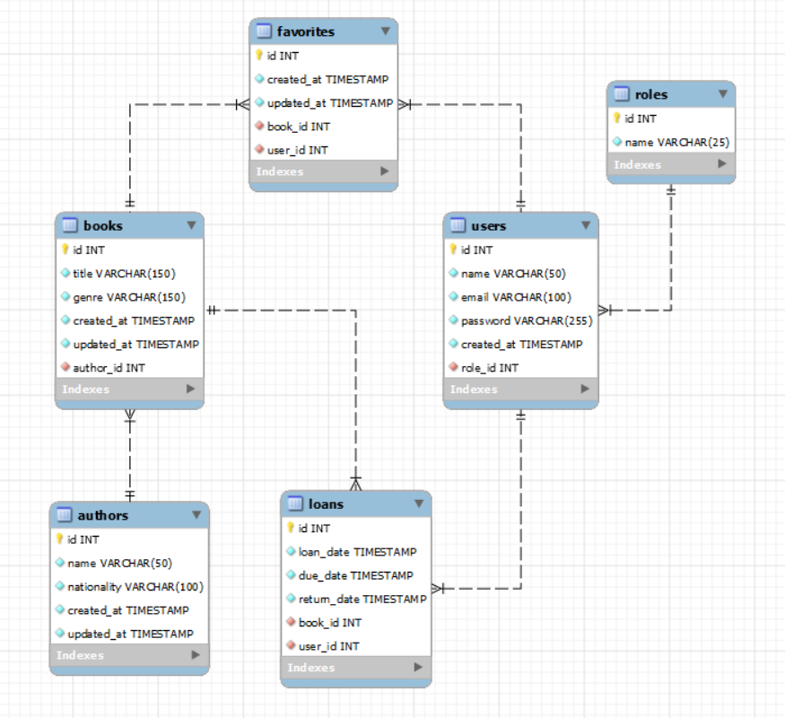

# Proyecto Backend sistema de gestión de citas para un estudio de tatuajes.

<details>
  <summary>Contenido 📝</summary>
  <ol>
    <li><a href="#sobre-el-proyecto">Sobre el proyecto</a></li>
    <li><a href="#objetivo">Objetivo</a></li>
    <li><a href="#diagrama-bd">Diagrama</a></li>
    <li><a href="#instalación-en-local">Instalación</a></li>
    <li><a href="#endpoints">Endpoints</a></li>
    <li><a href="#stack">Stack</a></li>
    <li><a href="#creación-del-proyecto">Creación del proyecto</a></li>
    <li><a href="#contacto">Contacto</a></li>

  </ol>
</details>

## Sobre el proyecto

Los usuarios podrán registrarse en la aplicación, iniciar sesión y acceder a su área
personal. Dentro de su área, podrán visualizar una lista de las citas programadas
para servicios de tatuajes y piercing, así como crear nuevas citas para diversos
servicios que ofrece el estudio.

El backend de esta API está desplegado en [Enlace a Zeabur](https://proyecto4-tatuajes.zeabur.app/hello)

## Objetivo

Este proyecto requería una API funcional conectada a una base de datos con cuatro tablas relacionales para Roles, Usuarios, Servicios y Citas

## Diagrama BD



## Instalación en local

1. Clonar el repositorio
2. Instalamos las dependencias `$ npm install`
3. Conectamos nuestro repositorio con la base de datos
4. Ejecutamos las migraciones `$ npm run migrations`
5. Ejecutamos los seeders `$ npm run seeder`
6. Ponemos en funcionamiento el servidor `$ npm run dev`

## Endpoints

<details>
<summary>Endpoints</summary>

- AUTH

  - REGISTER

            POST http://localhost:4000/api/auth/register

    body:

    ```js
        {
            "first_name": "example",
            "last_name": "example",
            "email": "example@gmail.com",
            "password": "princess"
        }
    ```

  - LOGIN

          POST http://localhost:4000/api/auth/login

    body:

    ```js
        {
            "email": "example@gmail.com",
            "password": "princess"
        }
    ```

- USERS

  - GET

            GET http://localhost:4000/api/users

    El usuario tiene que ser super_admin para ver todos los usuarios

  - GET BY EMAIL

            GET http://localhost:4000/api/users?email=example@email.com

    El usuario tiene que ser super_admin para ver todos los usuarios y la búsqueda le devolverá el usuario por email

    ```js
        {
            "success": true,
            "message": "User by email",
            "data": [
    	    {
    		"id": 35,
    		"first_name": "Ralph",
    		"last_name": "Marquardt",
    		"email": "admin@admin.com"
    	    }
            ]
        }
    ```
  - GET PROFILE

        GET http://localhost:4000/api/users/profile

    El usuario podrá ver su propio perfil
    
     ```js
        {
            "success": true,
	        "message": "Your profile",
	        "data": {
		        "id": 35,
		        "first_name": "Ralph",
		        "last_name": "Marquardt",
		        "email": "admin@admin.com"
	}
        }
    ```
  - UPDATE PROFILE

        PUT http://localhost:4000/api/users/profile

    El usuario podrá modificar su propio perfil, cambiando los campos que considere necesario (excepto el email)
    
     ```js
        {
        "first_name":"example",
        "last_name": "example",
        "password": "123456789"
        }
    ```
- SERVICES

  - GET

            GET http://localhost:4000/api/services

    

  - POST SERVICES

            POST http://localhost:4000/api/services

    El usuario tiene que ser super_admin para crear servicios del estudio

    body:
    ```js
        {
        "serviceName": "Blackout",
        "description": "Servicio de tatuaje en negro sobre tatuaje existente"
        }
    ```
- APPOINTMENTS

  - GET MY APPOINTMENTS

            GET http://localhost:4000/api/appointments

    El usuario puede ver todas las citas que tiene creadas


  - GET SINGLE APPOINTMENT

          GET http://localhost:4000/api/appointments/id

    El usuario puede ver una cita en concreto

  - CREATE APPOINTMENT

          POST http://localhost:4000/api/appointments

    El usuario puede crear una cita en una fecha y para un servicio concreto

    body:

    ```js
        {
        "appointment_date": "2024-03-24 09:00:00",
	    "service_id ": 1
        }
    ```

  - UPDATE SINGLE APPOINTMENT

          PUT http://localhost:4000/api/appointments/id

    El usuario puede modificar la fecha de una de sus citas

    body:

    ```js
        {
        "appointment_date": "2024-03-25 10:00:00"
        }
    ```


  </details>

## Stack

Tecnologías utilizadas:

<div align="center">
<a href="https://www.mysql.com/">
    
</a>
<a href="https://www.expressjs.com/">
    
</a>
<a href="https://nodejs.org/en/">
    
</a>
<a href="https://www.typescriptlang.org/">
    
</a>
<a href="https://typeorm.io/">
    
</a>

 </div>

## Creación del proyecto

### Pasos para la Instalación y Configuración

#### Para configurar un proyecto de Express con TypeScript, sigue estos pasos:

- Crea una carpeta para tu proyecto.

- Inicializa el archivo package.json con

` npm init`

- Instala Express con

`npm install express --save`

- Instala TypeScript como dependencia de desarrollo con

`npm install typescript -D`

- Instala los tipos de Express y Node con

`npm install @types/express @types/node -D`

- Configura el archivo tsconfig.json con

` npx tsc --init`

- Instalar librería de nodemon

` npm install --save-dev nodemon`

## Script de compilación

En el apartado de scripts de package.json:

    "dev": "nodemon ./src/server.ts"

## Contacto

<a href = "mailto:aipachecogarcia@gmail.com
"></a>
<a href="https://www.linkedin.com/in/anapachecogarcia/" target="_blank"></a>

</p>
